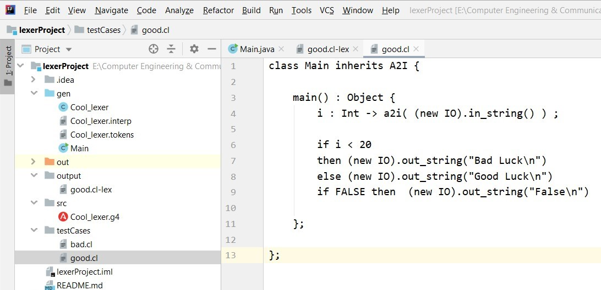
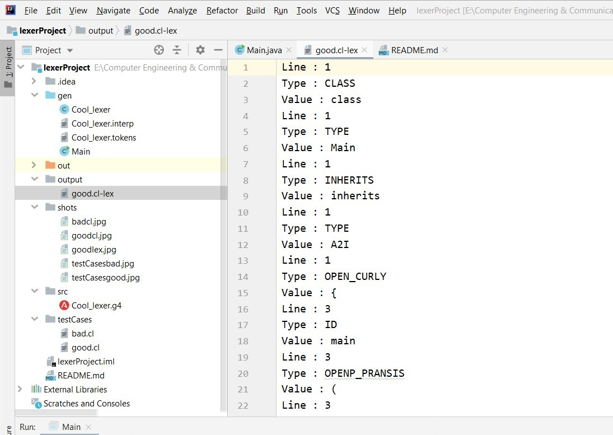
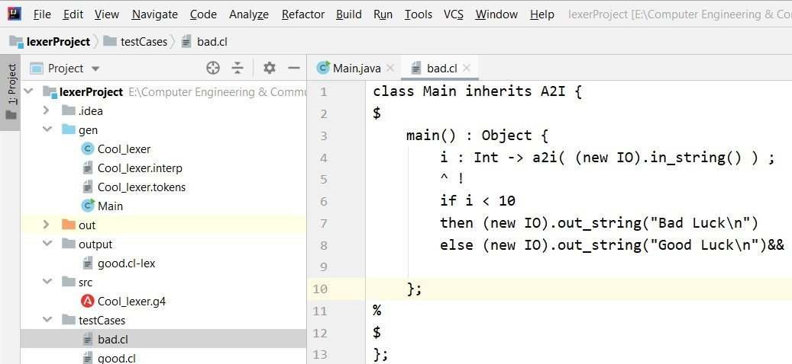
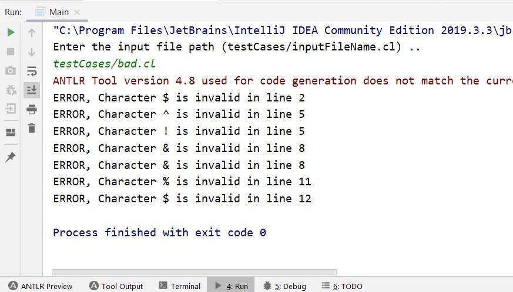

# Cool Compiler Project
## Compiler's project overview:

This project will direct you to design and build an interpreter for Cool. Each phase will cover one component of the interpreter:    lexical analysis, parsing, and code generation in three address code. Each phase will ultimately result in a working compiler phase which can interface with the other phases.

## Pre - Steps:
1) Install any ide such as Intellij, NetBeans (Intellij is preferred )
2) Follow this link to complete ANTLR V4 configuration: https://docs.google.com/document/d/1LZq93o6nc8j_m212T5monJFApjqdmuyK8uvRKLwuCok/edit
3) Generate the grammar (in this project it is Cool_lexer.g4), right click and Generate Antlr Recognizer.
4) Move the Main file to (gen), and then let the IDE run the program through the (gen).
5) File -> Project Structure -> Sources -> right click on (gen) -> choose sources -> remove (src) from sources.

## The first phase ( Lexical analysis )
### Goal :
Lexical analysis is the first phase of a compiler. It takes the modified source code from language preprocessors that are written in the form of sentences. The lexical analyzer breaks these syntaxes into a series of tokens, by removing any whitespace or comments in the source code.
If the lexical analyzer finds a token invalid, it generates an error. The lexical analyzer works closely with the syntax analyzer. It reads character streams from the source code, checks for legal tokens, and passes the data to the syntax analyzer.

### Specifications :
1) A program that takes a single command-line argument (e.g., file.cl). That argument will be an ASCII text Cool source file. Your program must either indicate that there is an error in the input (e.g., a malformed string) or emit file.cl-lex, a serialized list of Cool tokens.

2) Test cases good.cl and bad.cl. The first should lex correctly and yield a sequence of tokens. The second should contain an error.

### Steps :
1) Run the Main file after moving it to (gen).

2) Type the cool input file path **"testCases/inputFileName.cl"**.
##### Note that:
* Here we have two given files with the project stored in **testCases** directory, **"good.cl"** & **"bad.cl"**, first one lexes correctly and gives an output file with lexical tokens in the **output** directory under the name of **"good.cl-lex"**, second one cannot lex due to some reported errors.

* The output file for the good cool syntax includes all tokens with detailed info about the line no., type and value.

### Shots :
For the **"good.cl"** input cool file, here are some shots for the following:
1) **Cool source code :**

2) **Run command :**

3) **Cropped output tokens file :**

For the **"bad.cl"** input cool file, here are some shots for the following:
1) **Cool source code :**

2) **Run command :**

